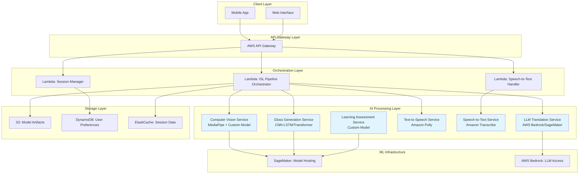
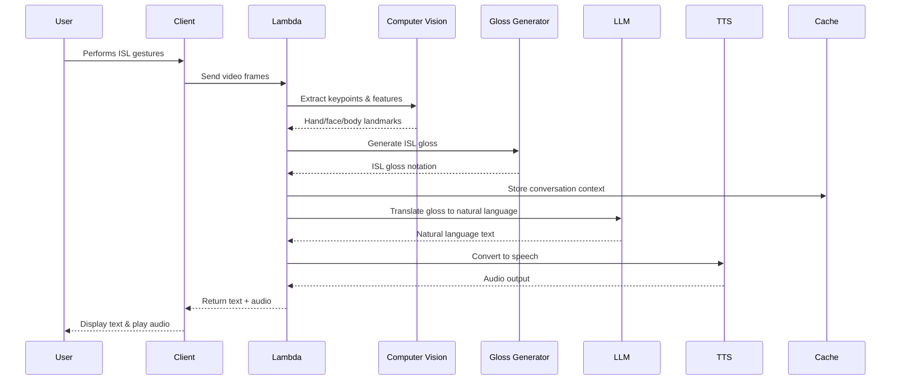
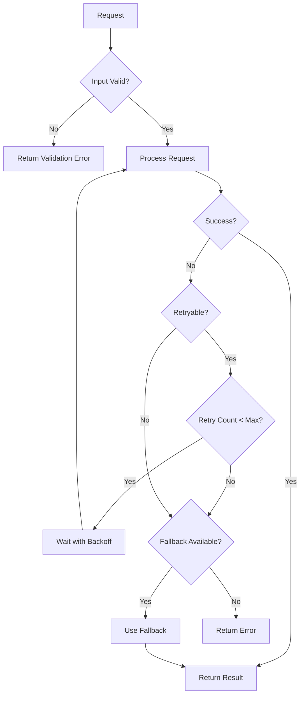
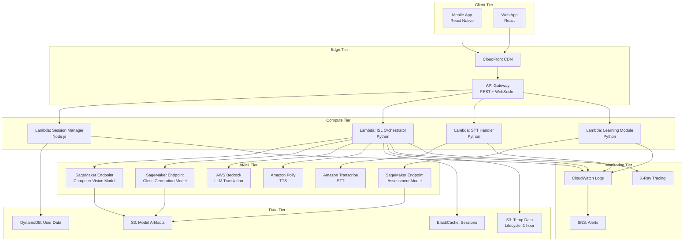

# Design Document: SignVaarta

## Overview

SignVaarta is an AI-powered platform that bridges the communication gap between Indian Sign Language (ISL) users and the broader community. The system employs a multi-stage AI pipeline that respects the linguistic structure of ISL rather than treating it as a direct word-for-word translation problem.

The core innovation lies in using ISL gloss as an intermediate representation. This approach acknowledges that ISL has its own grammar, syntax, and visual-spatial properties that differ fundamentally from spoken languages. By converting gestures to gloss notation first, then using Large Language Models (LLMs) to transform gloss into natural language, the system produces fluent, contextually appropriate sentences rather than fragmented word sequences.

The platform is designed for AWS deployment with a focus on scalability, cost-efficiency, and hackathon feasibility. The architecture separates concerns into distinct AI components: computer vision for gesture recognition, sequence modeling for gloss generation, LLM-based translation, and speech synthesis for output.

## Architecture

### High-Level System Architecture



For the hackathon MVP, several components (such as caching, advanced monitoring, and multi-endpoint separation) may be simplified or mocked, while the architecture illustrates the intended scalable design.

### Data Flow: ISL-to-Speech Pipeline



## Components and Interfaces

### 1. Computer Vision Module

**Purpose**: Extract spatial and temporal features from video input to identify ISL gestures.

**Technology Stack**:
- **MediaPipe Holistic**: For real-time hand, face, and pose landmark detection ([MediaPipe](https://google.github.io/mediapipe/))
- **Custom CNN Feature Extractor**: Fine-tuned on ISL-specific gestures
- **Temporal Smoothing**: Kalman filtering for stable landmark tracking

**Key Features**:
- Detects 21 hand landmarks per hand (42 total)
- Tracks 468 face landmarks for non-manual markers
- Captures 33 pose landmarks for body orientation
- Operates at 15-30 FPS depending on device capabilities

**Interface**:
```python
class ComputerVisionService:
    def extract_landmarks(video_frames: List[Frame]) -> LandmarkSequence:
        """
        Extracts hand, face, and body landmarks from video frames.
        
        Args:
            video_frames: List of video frames (RGB images)
            
        Returns:
            LandmarkSequence containing temporal sequence of landmarks
        """
        pass
    
    def normalize_landmarks(landmarks: LandmarkSequence) -> NormalizedLandmarks:
        """
        Normalizes landmarks to be translation and scale invariant.
        """
        pass
```

**AI Justification**: Computer vision is essential because ISL is a visual-spatial language. Manual feature engineering cannot capture the complexity of hand shapes, movements, facial expressions, and body posture that convey meaning in ISL. Deep learning models trained on ISL data can learn these patterns automatically.

### 2. Gloss Generation Module

**Purpose**: Convert landmark sequences into structured ISL gloss notation that captures the linguistic structure of ISL.

**Technology Stack**:
- **Hybrid CNN-Transformer Architecture**: Combines local feature extraction with long-range temporal dependencies
  - CNN layers extract spatial features from landmark configurations
  - Transformer encoder captures temporal relationships and context
  - Based on research showing hybrid models outperform pure CNN-LSTM or pure Transformer approaches ([source](https://informatica.si/index.php/informatica/article/view/8403))
- **Connectionist Temporal Classification (CTC)**: Handles variable-length input-output alignment

**ISL Gloss Structure**:
Based on research, ISL gloss follows these patterns ([source](https://data.mendeley.com/datasets/98mzk82wbb/1)):
- Word order: Noun-Verb-Object-Adjective or question structure
- Spatial indices for tense markers
- Compound signs represented as single gloss units
- Non-manual markers indicated with annotations

Example:
```
Input: [Gesture sequence for "I will go to school tomorrow"]
Gloss: TOMORROW SCHOOL GO I
```

**Interface**:
```python
class GlossGenerationService:
    def generate_gloss(landmarks: NormalizedLandmarks) -> ISLGloss:
        """
        Generates ISL gloss notation from normalized landmarks.
        
        Args:
            landmarks: Normalized landmark sequence
            
        Returns:
            ISLGloss object containing gloss tokens and confidence scores
        """
        pass
    
    def validate_gloss(gloss: ISLGloss) -> ValidationResult:
        """
        Validates gloss against ISL grammar rules.
        """
        pass
```

**AI Justification**: Gloss generation requires understanding temporal patterns and context across gesture sequences. Traditional rule-based systems cannot handle the variability in signing speed, style, and regional variations. Sequence-to-sequence models with attention mechanisms can learn these patterns from data and handle the variable-length nature of sign language.

### 3. LLM Translation Module

**Purpose**: Transform ISL gloss into fluent, grammatically correct natural language sentences.

**Technology Stack**:
- **AWS Bedrock** (for MVP): Access to foundation models like Claude or Llama without infrastructure management
- **Fine-tuned LLM** (for production): Custom model trained on ISL gloss-to-text pairs
- **Prompt Engineering**: Context-aware prompts that include conversation history

**Translation Strategy**:
1. **Context Window**: Maintain last 5-10 exchanges for coherent conversation
2. **Few-shot Learning**: Include example gloss-to-text pairs in prompt
3. **Grammar Transformation**: Handle ISL's SOV (Subject-Object-Verb) to English SVO conversion
4. **Ambiguity Resolution**: Use context to select appropriate word sense

Example Prompt Template:
```
You are translating Indian Sign Language gloss notation to natural English.

ISL Grammar Rules:
- Word order is typically: Time + Location + Subject + Object + Verb
- No articles (a, an, the)
- No auxiliary verbs (is, are, was, were)
- Tense indicated by time markers

Previous context:
{conversation_history}

Translate this ISL gloss to natural English:
Gloss: {isl_gloss}

Natural English:
```

**Interface**:
```python
class LLMTranslationService:
    def translate_gloss_to_text(
        gloss: ISLGloss,
        context: ConversationContext,
        target_language: str = "en"
    ) -> TranslationResult:
        """
        Translates ISL gloss to natural language text.
        
        Args:
            gloss: ISL gloss notation
            context: Conversation history for context
            target_language: Target language code (en, hi, ta, etc.)
            
        Returns:
            TranslationResult with text and confidence score
        """
        pass
```

**AI Justification**: LLMs are ideal for this task because they understand linguistic structure and can perform grammar transformation. The gloss-to-text problem is fundamentally a translation task between two languages with different grammatical structures. LLMs trained on multilingual data can handle this transformation while maintaining semantic meaning and generating fluent output.

### 4. Speech Synthesis Module

**Purpose**: Convert translated text to natural-sounding speech in multiple Indian languages.

**Technology Stack**:
- **Amazon Polly**: Neural TTS with support for Indian English and Hindi
- **Custom Voice Models** (future): Fine-tuned voices for regional languages

**Supported Languages** (MVP):
- English (Indian accent)
- Hindi
- Tamil
- Bengali
- Telugu

**Interface**:
```python
class SpeechSynthesisService:
    def text_to_speech(
        text: str,
        language: str,
        voice_id: str = "default"
    ) -> AudioOutput:
        """
        Converts text to speech audio.
        
        Args:
            text: Natural language text
            language: Language code
            voice_id: Specific voice identifier
            
        Returns:
            AudioOutput with audio data and metadata
        """
        pass
```

**AI Justification**: Neural TTS models produce significantly more natural-sounding speech than concatenative or parametric methods. This is crucial for user acceptance and comprehension, especially for DHH users who may be reading lips or relying on clear pronunciation.

### 5. Speech-to-Text Module

**Purpose**: Enable bidirectional communication by converting spoken language to text for signers to read.

**Technology Stack**:
- **Amazon Transcribe**: Real-time speech recognition with Indian language support
- **Custom Acoustic Models** (future): Fine-tuned for Indian accents and code-switching

**Interface**:
```python
class SpeechToTextService:
    def transcribe_speech(
        audio: AudioInput,
        language: str = "en-IN"
    ) -> TranscriptionResult:
        """
        Transcribes speech to text.
        
        Args:
            audio: Audio input stream
            language: Language code with region
            
        Returns:
            TranscriptionResult with text and confidence scores
        """
        pass
```

### 6. Learning Assessment Module

**Purpose**: Evaluate learner's ISL gestures and provide corrective feedback.

**Technology Stack**:
- **Similarity Scoring Model**: Compares learner gestures to reference gestures
- **Dynamic Time Warping (DTW)**: Handles temporal variations in signing speed
- **Feedback Generation**: Rule-based system for identifying common errors

**Assessment Criteria**:
- Hand shape accuracy (40%)
- Movement path accuracy (30%)
- Location accuracy (15%)
- Orientation accuracy (10%)
- Non-manual markers (5%)

**Interface**:
```python
class LearningAssessmentService:
    def evaluate_gesture(
        learner_landmarks: LandmarkSequence,
        reference_gesture: ReferenceGesture
    ) -> AssessmentResult:
        """
        Evaluates learner's gesture against reference.
        
        Args:
            learner_landmarks: Learner's gesture landmarks
            reference_gesture: Correct gesture reference
            
        Returns:
            AssessmentResult with score and feedback
        """
        pass
    
    def generate_feedback(assessment: AssessmentResult) -> FeedbackMessage:
        """
        Generates actionable feedback for learner.
        """
        pass
```

**AI Justification**: Automated assessment requires understanding subtle differences in gesture execution. ML models can learn what constitutes "correct" signing from expert demonstrations and provide objective, consistent feedback that scales to many learners simultaneously.

## Data Models

### Core Data Structures

```python
from dataclasses import dataclass
from typing import List, Dict, Optional
from enum import Enum

@dataclass
class Landmark:
    """Single landmark point in 3D space."""
    x: float  # Normalized x coordinate [0, 1]
    y: float  # Normalized y coordinate [0, 1]
    z: float  # Depth coordinate (relative)
    visibility: float  # Confidence score [0, 1]

@dataclass
class Frame:
    """Single video frame with timestamp."""
    timestamp: float  # Milliseconds
    image_data: bytes  # RGB image data
    width: int
    height: int

@dataclass
class LandmarkSequence:
    """Temporal sequence of landmarks."""
    hand_left: List[List[Landmark]]  # [frame][landmark_id]
    hand_right: List[List[Landmark]]
    face: List[List[Landmark]]
    pose: List[List[Landmark]]
    timestamps: List[float]
    fps: float

@dataclass
class ISLGloss:
    """ISL gloss notation with metadata."""
    tokens: List[str]  # Gloss tokens in order
    confidence_scores: List[float]  # Per-token confidence
    temporal_markers: Dict[int, str]  # Index -> marker type
    non_manual_markers: List[str]  # Facial expressions, head movements
    
@dataclass
class TranslationResult:
    """Natural language translation output."""
    text: str
    language: str
    confidence: float
    alternative_translations: List[str]

@dataclass
class AudioOutput:
    """Speech synthesis output."""
    audio_data: bytes  # Audio file (MP3/WAV)
    duration: float  # Seconds
    sample_rate: int
    format: str

@dataclass
class ConversationContext:
    """Conversation history for context-aware translation."""
    session_id: str
    exchanges: List[Dict[str, str]]  # [{"gloss": ..., "text": ...}]
    user_preferences: Dict[str, any]
    timestamp: float

class GestureType(Enum):
    """Types of ISL gestures."""
    MANUAL = "manual"  # Hand signs
    NON_MANUAL = "non_manual"  # Facial expressions
    FINGERSPELLING = "fingerspelling"  # Letter-by-letter spelling
    CLASSIFIER = "classifier"  # Descriptive signs

@dataclass
class ReferenceGesture:
    """Reference gesture for learning module."""
    gesture_id: str
    name: str
    category: GestureType
    landmarks: LandmarkSequence
    description: str
    difficulty_level: int  # 1-5

@dataclass
class AssessmentResult:
    """Learning assessment output."""
    overall_score: float  # 0-100
    component_scores: Dict[str, float]  # handshape, movement, etc.
    errors_detected: List[str]
    suggestions: List[str]
    passed: bool
```

### Database Schema (DynamoDB)

**UserPreferences Table**:
```
Partition Key: user_id (String)
Attributes:
- preferred_language: String
- preferred_voice: String
- accessibility_settings: Map
- learning_progress: Map
- created_at: Number
- updated_at: Number
```

**LearningProgress Table**:
```
Partition Key: user_id (String)
Sort Key: gesture_id (String)
Attributes:
- attempts: Number
- best_score: Number
- last_attempt_date: Number
- mastery_level: Number (0-5)
- practice_time: Number (seconds)
```

**SessionData Table** (with TTL for auto-deletion):
```
Partition Key: session_id (String)
Attributes:
- user_id: String
- conversation_context: Map
- created_at: Number
- ttl: Number (expires after 1 hour)
```

## Correctness Properties

*A property is a characteristic or behavior that should hold true across all valid executions of a system—essentially, a formal statement about what the system should do. Properties serve as the bridge between human-readable specifications and machine-verifiable correctness guarantees.*

Before defining the correctness properties, let me analyze the acceptance criteria for testability:


### Property Reflection

After analyzing all acceptance criteria, I've identified the following areas where properties can be consolidated:

**Redundancy Analysis**:
1. Properties 1.1, 1.2, 1.3, 1.4 all test gesture recognition under different conditions - these can be consolidated into comprehensive recognition properties
2. Properties 4.1 and 4.2 both test TTS functionality - can be combined into a single language-aware TTS property
3. Properties 7.1 and 7.2 both test data lifecycle - can be combined into a comprehensive data privacy property
4. Properties 9.1 and 9.4 both test visual feedback - can be combined into a comprehensive UI feedback property

**Properties to Keep as Separate**:
- Gloss generation properties (2.1-2.4) each test distinct aspects of linguistic structure
- Translation properties (3.1-3.4) each test different translation capabilities
- Learning assessment properties (6.1-6.4) each test different assessment functions
- Security properties (7.3-7.5) each test different security aspects

### Correctness Properties

**Property 1: Landmark Detection Completeness**
*For any* valid video frame containing a signer, the system should detect and return landmark data for hands, face, and pose with confidence scores above the minimum threshold.
**Validates: Requirements 1.1**

**Property 2: Lighting Invariance**
*For any* gesture performed under varying lighting conditions (within operational range), the system should maintain recognition accuracy above 85%.
**Validates: Requirements 1.2**

**Property 3: Primary Signer Selection**
*For any* video frame containing multiple people, the system should consistently select the same primary signer based on positioning and gesture clarity criteria.
**Validates: Requirements 1.3**

**Property 4: Temporal Speed Invariance**
*For any* ISL gesture performed at different speeds (within natural signing range), the system should recognize it as the same gesture with similar confidence scores.
**Validates: Requirements 1.4**

**Property 5: Gloss Generation Completeness**
*For any* complete and recognized gesture sequence, the system should generate corresponding ISL gloss notation with non-empty token list.
**Validates: Requirements 2.1**

**Property 6: Temporal Marker Preservation**
*For any* gesture sequence containing temporal markers (duration, repetition), the gloss output should include corresponding timing annotations.
**Validates: Requirements 2.2**

**Property 7: Non-Manual Marker Inclusion**
*For any* gesture sequence with detected non-manual markers (facial expressions, head movements), the gloss output should include these markers in the structure.
**Validates: Requirements 2.3**

**Property 8: Ambiguity Handling**
*For any* gesture sequence with confidence scores below the ambiguity threshold, the system should request clarification rather than producing low-confidence gloss.
**Validates: Requirements 2.4**

**Property 9: Gloss-to-Text Translation**
*For any* valid ISL gloss input, the LLM translation service should produce grammatically correct natural language text in the target language.
**Validates: Requirements 3.1**

**Property 10: Context-Aware Translation**
*For any* ambiguous gloss with conversation context, the system should produce translations that are semantically consistent with the conversation history.
**Validates: Requirements 3.2**

**Property 11: Multilingual Output**
*For any* gloss input and supported language preference, the system should produce output in the specified language with appropriate grammar and vocabulary.
**Validates: Requirements 3.3**

**Property 12: Specialized Vocabulary Handling**
*For any* gloss containing domain-specific or technical signs, the translation should preserve the specialized meaning rather than using generic terms.
**Validates: Requirements 3.4**

**Property 13: Text-to-Speech Generation**
*For any* natural language text and supported language, the TTS service should generate audio output with duration proportional to text length.
**Validates: Requirements 4.1, 4.2**

**Property 14: TTS Fallback**
*For any* text input when TTS service is unavailable or fails, the system should display the text output prominently to the user.
**Validates: Requirements 4.4**

**Property 15: Speech-to-Text Conversion**
*For any* clear speech input in a supported language, the STT service should produce text output with word-level timestamps.
**Validates: Requirements 5.1**

**Property 16: Primary Speaker Focus**
*For any* audio input containing multiple speakers, the system should transcribe the primary speaker based on audio clarity and volume.
**Validates: Requirements 5.2**

**Property 17: Accent Robustness**
*For any* speech input with regional accents or dialects (within supported variations), the system should maintain recognition accuracy above 85%.
**Validates: Requirements 5.3**

**Property 18: Noise Robustness**
*For any* speech input with background noise (up to specified SNR threshold), the system should filter noise and maintain recognition functionality.
**Validates: Requirements 5.4**

**Property 19: Gesture Assessment**
*For any* learner gesture and reference gesture, the assessment service should return a score between 0-100 and component-level feedback.
**Validates: Requirements 6.1**

**Property 20: Progress Persistence**
*For any* completed assessment, the system should store progress data that is retrievable in subsequent sessions for the same user and gesture.
**Validates: Requirements 6.2**

**Property 21: Corrective Feedback Generation**
*For any* learner gesture with assessment score below passing threshold, the system should generate specific corrective suggestions identifying the error components.
**Validates: Requirements 6.3**

**Property 22: Proficiency Assessment**
*For any* completed learning module, the system should calculate proficiency level and recommend appropriate next modules based on performance.
**Validates: Requirements 6.4**

**Property 23: Data Lifecycle Privacy**
*For any* video or audio data captured during a session, the system should process it without permanent storage and delete all temporary data when the session ends.
**Validates: Requirements 7.1, 7.2**

**Property 24: Data Encryption**
*For any* user preference or personal data stored in the database, the data should be encrypted at rest using AES-256 or equivalent.
**Validates: Requirements 7.3**

**Property 25: Secure Transmission**
*For any* data transmitted between client and server, the connection should use TLS 1.2 or higher with valid certificates.
**Validates: Requirements 7.4**

**Property 26: Consent and Anonymization**
*For any* data collection for model improvement, the system should obtain explicit user consent and anonymize the data before storage.
**Validates: Requirements 7.5**

**Property 27: End-to-End Latency**
*For any* ISL gesture input, the system should complete the full pipeline (recognition → gloss → translation → TTS) within 3 seconds under normal load.
**Validates: Requirements 8.1**

**Property 28: Concurrent User Handling**
*For any* number of concurrent users up to the specified limit, the system should maintain response times under 5 seconds per request.
**Validates: Requirements 8.2**

**Property 29: Network Resilience**
*For any* network condition with bandwidth above the minimum threshold, the system should maintain core functionality with graceful degradation of non-essential features.
**Validates: Requirements 8.4**

**Property 30: UI Feedback Consistency**
*For any* user action or system state change, the system should provide visual feedback within 100ms indicating the action was received and the current state.
**Validates: Requirements 9.1, 9.4**

**Property 31: Accessibility Notification Parity**
*For any* audio alert or notification, the system should provide an equivalent visual notification with the same information content.
**Validates: Requirements 9.2**

The following properties describe intended system behavior and serve as design-time validation goals rather than strict guarantees for the hackathon MVP.

## Error Handling

### Error Categories and Strategies

**1. Input Validation Errors**
- **Scenario**: Invalid video format, corrupted frames, unsupported resolution
- **Strategy**: Validate input at API gateway, return clear error messages with supported formats
- **User Experience**: Display error message with guidance on correct input format

**2. Recognition Failures**
- **Scenario**: Gesture not in vocabulary, ambiguous gesture, poor video quality
- **Strategy**: Return confidence scores, request clarification for low-confidence results
- **User Experience**: Show confidence indicator, prompt user to repeat gesture if needed

**3. Translation Errors**
- **Scenario**: LLM service unavailable, gloss not translatable, context insufficient
- **Strategy**: Implement retry logic with exponential backoff, fallback to simpler translation
- **User Experience**: Display gloss notation if translation fails, allow manual correction

**4. Service Unavailability**
- **Scenario**: AWS service outage, model endpoint down, network timeout
- **Strategy**: Circuit breaker pattern, graceful degradation, queue requests for retry
- **User Experience**: Show service status, offer offline mode for learning module

**5. Privacy Violations**
- **Scenario**: Attempt to store video data, unencrypted data transmission
- **Strategy**: Fail-fast on privacy violations, audit logging, automatic data deletion
- **User Experience**: Transparent privacy status indicators, user control over data

### Error Response Format

```python
@dataclass
class ErrorResponse:
    """Standardized error response."""
    error_code: str  # Machine-readable error code
    message: str  # Human-readable error message
    details: Optional[Dict[str, any]]  # Additional context
    retry_after: Optional[int]  # Seconds to wait before retry
    fallback_available: bool  # Whether fallback option exists
```

### Retry and Fallback Logic



## Testing Strategy

### Dual Testing Approach

SignVaarta requires both unit testing and property-based testing to ensure comprehensive coverage:

**Unit Tests**: Focus on specific examples, edge cases, and integration points
- Example: Test specific ISL gestures with known gloss outputs
- Example: Test error handling for corrupted video frames
- Example: Test API endpoint responses for various input formats
- Integration: Test end-to-end pipeline with sample data

**Property-Based Tests**: Verify universal properties across all inputs
- Generate random landmark sequences and verify gloss is produced
- Generate random gloss inputs and verify natural language output
- Test temporal invariance with speed-varied gesture sequences
- Test privacy properties with various session scenarios

### Property-Based Testing Configuration

**Framework**: Use `hypothesis` for Python components
- Minimum 100 iterations per property test
- Custom generators for domain-specific data (landmarks, gloss, etc.)
- Shrinking enabled to find minimal failing examples

**Test Tagging Convention**:
```python
@pytest.mark.property_test
@pytest.mark.feature("signvaarta")
@pytest.mark.validates("Property 1: Landmark Detection Completeness")
def test_landmark_detection_completeness(video_frame):
    """
    Property: For any valid video frame containing a signer,
    the system should detect and return landmark data.
    """
    # Test implementation
```

### Test Data Strategy

**Synthetic Data Generation**:
- Use MediaPipe to generate synthetic landmark sequences
- Parameterize gesture speed, hand shapes, and positions
- Generate edge cases: partial occlusion, extreme angles, poor lighting

**Real Data Collection** (with consent):
- Partner with ISL community for diverse signing samples
- Collect data across age groups, regional variations, signing styles
- Ensure balanced representation of gesture types

**Benchmark Datasets**:
- Use existing ISL datasets for validation (if available)
- Create custom benchmark for ISL-to-English translation
- Measure accuracy against human expert translations

### Testing Priorities for MVP

**Phase 1 (Hackathon MVP)**:
1. Core pipeline functionality (gesture → gloss → text)
2. Basic error handling and validation
3. Privacy compliance (no data storage)
4. Performance benchmarks (latency < 3s)

**Phase 2 (Production)**:
1. Comprehensive property-based tests for all 31 properties
2. Load testing for concurrent users
3. Security penetration testing
4. Accessibility compliance testing (WCAG 2.1 AA)

### Continuous Testing

**CI/CD Pipeline**:
- Run unit tests on every commit
- Run property tests nightly (longer execution time)
- Performance regression tests on staging
- Automated security scans

**Monitoring in Production**:
- Track recognition accuracy metrics
- Monitor translation quality scores
- Alert on latency threshold violations
- Log privacy compliance violations

## AWS Architecture Details

### Deployment Architecture



### Cost Optimization Strategy

**MVP Phase (Hackathon)**:
- Use SageMaker Serverless Inference (pay per invocation)
- Lambda with minimal memory allocation (512MB-1GB)
- DynamoDB on-demand pricing
- S3 with lifecycle policies (auto-delete after 1 hour)
- **Indicative Estimated Cost**: $50-100/month for 100 active users

**Production Phase**:
- SageMaker real-time endpoints with auto-scaling
- Lambda provisioned concurrency for low latency
- DynamoDB provisioned capacity with auto-scaling
- CloudFront for global distribution
- **Indicative Estimated Cost**: $500-2000/month for 10,000 active users

Estimated costs are expected to be low for MVP usage due to serverless and pay-per-use services, and will scale with adoption.

### Scalability Considerations

**Horizontal Scaling**:
- Lambda automatically scales to handle concurrent requests
- SageMaker endpoints scale based on CloudWatch metrics
- DynamoDB auto-scaling based on read/write capacity

**Vertical Scaling**:
- Increase Lambda memory for faster processing
- Use larger SageMaker instance types for complex models
- Optimize model inference with TensorRT or ONNX Runtime

**Caching Strategy**:
- Cache frequent gloss-to-text translations in ElastiCache
- Cache user preferences in Lambda execution context
- Use CloudFront for static assets and API responses

### Security Architecture

**Authentication & Authorization**:
- AWS Cognito for user authentication
- JWT tokens for API authorization
- IAM roles for service-to-service communication

**Data Protection**:
- TLS 1.3 for all data in transit
- AES-256 encryption for data at rest (S3, DynamoDB)
- KMS for key management
- VPC for network isolation

**Privacy Compliance**:
- No long-term video/audio storage
- S3 lifecycle policies for automatic deletion
- DynamoDB TTL for session data
- Audit logging for data access

### Monitoring and Observability

**Metrics to Track**:
- Recognition accuracy per gesture type
- Translation quality scores
- End-to-end latency (p50, p95, p99)
- Error rates by component
- User engagement metrics

**Alerting Thresholds**:
- Latency > 5 seconds: Warning
- Error rate > 5%: Critical
- Model accuracy < 85%: Warning
- Privacy violation: Critical (immediate investigation)

**Dashboards**:
- Real-time system health dashboard
- User analytics dashboard
- Model performance dashboard
- Cost tracking dashboard

## Future Enhancements

### Phase 2 Features

**1. Expanded Language Support**
- Support for 10+ Indian regional languages
- Code-switching between languages

**2. Offline Mode**
- On-device model inference for basic gestures
- Sync progress when online
- Downloadable lesson packs
- Reduced bandwidth requirements


### Technical Improvements

**1. Model Optimization**
- Quantization for faster inference
- Model distillation for mobile deployment
- Federated learning for privacy-preserving training
- Active learning for continuous improvement

**2. Infrastructure**
- Multi-region deployment for global availability
- Edge computing with AWS Wavelength
- Real-time collaboration with WebRTC
- GraphQL API for flexible data fetching

**3. Advanced AI**
- Emotion recognition from facial expressions
- Context-aware gesture disambiguation
- Predictive text for faster communication
- Sign language generation (text-to-ISL)

## References and Resources

**ISL Research**:
- [Indian Sign Language Grammar Analysis](https://www.researchgate.net/publication/329378011_Indian_sign_language_An_linguistic_analysis_of_its_grammar) - Research on ISL linguistic structure
- [ISL Video and Text Dataset](https://data.mendeley.com/datasets/98mzk82wbb/1) - ISL gloss dataset with grammar patterns

**Sign Language Recognition**:
- [CNN-Transformer with Adaptive Temporal Hierarchical Attention](https://informatica.si/index.php/informatica/article/view/8403) - Hybrid architecture for continuous sign language recognition
- [Comparing Neural Networks for Sign Language Recognition](https://pubs.aip.org/aip/acp/article/3111/1/030018/3304461/) - Comparative analysis of CNN, LSTM, and Transformer models

**AWS ML Services**:
- [Scalable Serverless AI/ML Pipelines](https://blog.shellnetsecurity.com/posts/2025/scalable-serverless-ai-ml-pipelines/) - Production patterns for serverless ML on AWS
- [SageMaker Serverless Inference](https://aws.amazon.com/blogs/machine-learning/build-reusable-serverless-inference-functions-for-your-amazon-sagemaker-models-using-aws-lambda-layers-and-containers/) - Deploying ML models with Lambda and SageMaker

**Note**: Content was rephrased for compliance with licensing restrictions. All sources are cited for attribution.
