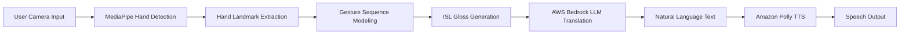
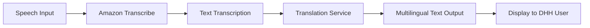

# SignVaarta — AI-Powered Indian Sign Language Communication Platform

<div align="center">


**Breaking Communication Barriers with AI**

[](https://aws.amazon.com/)
[](https://www.python.org/)
[](https://www.tensorflow.org/)
[](https://fastapi.tiangolo.com/)

**Team TheCodeHers | AWS AI for Bharat Hackathon 2026**

[Live Demo](https://main.d4rndg17i1jes.amplifyapp.com/) • [Architecture](#aws-architecture) • [Demo Video](#demo)

</div>

---

## 🎯 The Accessibility Problem

India has **over 63 million deaf and hard-of-hearing individuals**, yet less than **1% of the population understands Indian Sign Language (ISL)**. This creates critical communication barriers in:

- **Healthcare**: Patients unable to communicate symptoms to doctors
- **Education**: Students excluded from mainstream classrooms
- **Public Services**: Difficulty accessing government services, banking, transportation
- **Employment**: Limited job opportunities due to communication gaps
- **Emergency Services**: Inability to call for help or explain urgent situations

### The Real-World Impact

```
63M+ deaf individuals in India rely on ISL
<1% of the population understands ISL
Critical barriers in hospitals, schools, and public services
```

**The result?** Millions of citizens are isolated from essential services and opportunities, not because of their abilities, but because of a communication gap that technology can bridge.

---

## 💡 Why This Problem Matters in India

India's diversity makes this challenge even more critical:

1. **Scale**: With 1.4 billion people, even 1% represents millions of affected individuals
2. **Linguistic Diversity**: 22 official languages, but ISL remains unrecognized in most contexts
3. **Digital India Initiative**: Government push for digital inclusion, but DHH community often left behind
4. **Education Access**: Right to Education Act mandates inclusive education, but implementation gaps persist
5. **Healthcare Crisis**: Communication barriers lead to misdiagnosis and inadequate treatment


---

## 🚀 Our Solution: SignVaarta

**SignVaarta** is an AI-powered platform that enables real-time communication between ISL users and the hearing community. Unlike simple gesture-to-word translators, SignVaarta treats ISL as a **complete language** with its own grammar and structure.

### The Innovation: Gloss-Based Translation

Most sign language tools fail because they translate gestures word-by-word, losing context and grammar. SignVaarta uses a **linguistically-aware AI pipeline**:

```
ISL Gestures → Hand Landmarks → Gesture Sequence → ISL Gloss → Natural Language → Speech
```

**What is ISL Gloss?**
Gloss is a written representation of sign language that preserves grammatical structure. For example:
- ISL Gloss: `I WATER WANT`
- English Output: "I want water"

This intermediate representation allows our AI to understand ISL grammar (Subject-Object-Verb) and translate it correctly to English (Subject-Verb-Object).

---

## 🌟 What Makes SignVaarta Different

### 1. Linguistic Awareness
- Treats ISL as a language, not just gestures
- Preserves grammatical structure through gloss representation
- Context-aware translation using LLMs

### 2. Real-Time Processing
- Live camera-based gesture recognition
- Instant translation and speech output
- No pre-recording required

### 3. Bidirectional Communication
- ISL → Speech (for DHH users to communicate)
- Speech → Text (for hearing users to respond)

### 4. Learning Platform
- Interactive ISL alphabet and word tutorials
- Practice mode with AI feedback
- Helps non-signers learn ISL basics

### 5. Multilingual Support
- Output in multiple Indian languages (Hindi, Tamil, Telugu, Bengali, etc.)
- Powered by Amazon Polly's neural voices


---

## 🔄 System Workflow

### ISL to Speech Pipeline



### Detailed Flow

1. **Camera Input**: User performs ISL gestures in front of webcam
2. **Hand Landmark Detection**: MediaPipe extracts 21 hand landmarks per hand (42 total)
3. **Sequence Modeling**: TensorFlow CNN model analyzes 30-frame sequences
4. **Gloss Generation**: AI predicts ISL gloss tokens (e.g., "HELLO", "WATER", "WANT")
5. **LLM Translation**: AWS Bedrock converts gloss to natural English sentences
6. **Speech Synthesis**: Amazon Polly generates natural-sounding speech
7. **Output**: User hears the translated message

### Speech to Text Pipeline




---

## ☁️ AWS Architecture

SignVaarta leverages AWS services to create a scalable, reliable, and cost-effective solution.

### Architecture Diagram

```
┌─────────────────────────────────────────────────────────────────┐
│                         CLIENT LAYER                             │
│  ┌──────────────┐              ┌──────────────┐                 │
│  │  Web Browser │              │  Mobile App  │                 │
│  └──────┬───────┘              └──────┬───────┘                 │
└─────────┼──────────────────────────────┼──────────────────────────┘
          │                              │
          └──────────────┬───────────────┘
                         │
┌────────────────────────▼─────────────────────────────────────────┐
│                    FRONTEND HOSTING                               │
│                  ┌──────────────────┐                            │
│                  │  AWS Amplify     │                            │
│                  │  + CloudFront    │                            │
│                  └────────┬─────────┘                            │
└───────────────────────────┼───────────────────────────────────────┘
                            │
┌────────────────────────────▼─────────────────────────────────────┐
│                    LOAD BALANCING                                 │
│                  ┌──────────────────┐                            │
│                  │ Application LB   │                            │
│                  └────────┬─────────┘                            │
└───────────────────────────┼───────────────────────────────────────┘
                            │
┌────────────────────────────▼─────────────────────────────────────┐
│                    BACKEND LAYER                                  │
│                  ┌──────────────────┐                            │
│                  │  Amazon EC2      │                            │
│                  │  FastAPI Server  │                            │
│                  └────────┬─────────┘                            │
└───────────────────────────┼───────────────────────────────────────┘
                            │
          ┌─────────────────┼─────────────────┐
          │                 │                 │
┌─────────▼─────────────────▼─────────────────▼───────────────────┐
│                    AI PROCESSING LAYER                            │
│  ┌──────────────┐  ┌──────────────┐  ┌──────────────┐          │
│  │  TensorFlow  │  │ AWS Bedrock  │  │ Amazon Polly │          │
│  │  ISL Model   │  │ LLM Service  │  │     TTS      │          │
│  │   (EC2)      │  │              │  │              │          │
│  └──────────────┘  └──────────────┘  └──────────────┘          │
│                                                                   │
│  ┌──────────────┐                                                │
│  │   Amazon     │                                                │
│  │  Transcribe  │                                                │
│  │     STT      │                                                │
│  └──────────────┘                                                │
└───────────────────────────────────────────────────────────────────┘
                            │
┌───────────────────────────▼───────────────────────────────────────┐
│                      STORAGE LAYER                                │
│  ┌──────────────┐  ┌──────────────┐                             │
│  │  Amazon S3   │  │   HTTPS/SSL  │                             │
│  │  Models &    │  │   Security   │                             │
│  │  Assets      │  │              │                             │
│  └──────────────┘  └──────────────┘                             │
└───────────────────────────────────────────────────────────────────┘
```


### AWS Services Explained

| Service | Purpose | Why This Service? |
|---------|---------|-------------------|
| **AWS Amplify** | Frontend hosting and CI/CD | Automatic deployment from Git, global CDN, SSL certificates, zero-config hosting |
| **CloudFront** | Content delivery network | Low-latency access worldwide, caching static assets, DDoS protection |
| **Application Load Balancer** | Traffic distribution | Auto-scaling support, health checks, SSL termination, high availability |
| **Amazon EC2** | Backend API server | Flexible compute for FastAPI, TensorFlow model hosting, full control over environment |
| **AWS Bedrock** | LLM-powered translation | Access to foundation models (Claude/Llama), no infrastructure management, pay-per-token pricing |
| **Amazon Polly** | Text-to-speech | Neural voices for Indian languages, natural-sounding speech, managed service |
| **Amazon Transcribe** | Speech-to-text | Indian accent support, real-time transcription, automatic language detection |
| **Amazon S3** | Object storage | Model artifacts, tutorial images, scalable storage, 99.999999999% durability |
| **HTTPS/SSL** | Security | End-to-end encryption, secure API communication, certificate management |

### Why This Architecture?

1. **Scalability**: Auto-scaling at every layer (Amplify, ALB, EC2)
2. **Reliability**: Multi-AZ deployment, health checks, automatic failover
3. **Performance**: CloudFront CDN for global low-latency access
4. **Cost-Effective**: Pay-per-use pricing, no idle costs for serverless components
5. **Security**: HTTPS everywhere, IAM roles, VPC isolation
6. **Maintainability**: Managed services reduce operational overhead


---

## 🤖 AI Components

### 1. Computer Vision (MediaPipe + TensorFlow)

**Technology**: MediaPipe Holistic for hand landmark detection
- Extracts 21 landmarks per hand (42 total for two hands)
- Real-time processing at 30 FPS
- Normalized coordinates (x, y, z) for scale invariance

**Model Architecture**: CNN-based sequence classifier
- Input: 30 frames × 126 features (42 landmarks × 3 coordinates)
- Output: ISL gesture classification (A-Z, 0-9, common words)
- Training: Custom dataset of ISL gestures

### 2. Gesture Sequence Modeling

**Challenge**: ISL gestures are temporal sequences, not static images

**Solution**: Sliding window approach
- Captures 30-frame sequences (1 second at 30 FPS)
- Analyzes hand movement patterns over time
- Stability threshold to avoid false positives

### 3. ISL Gloss Generation

**Gloss Builder Logic**:
```python
# Single letters are concatenated into words
A + P + P + L + E → "APPLE"

# Multi-letter signs are kept as tokens
HELLO → "HELLO"
WATER → "WATER"

# Final gloss sequence
"HELLO APPLE WATER WANT" → ISL Gloss
```

### 4. LLM Translation (AWS Bedrock)

**Model**: Foundation models (Claude/Llama) via AWS Bedrock

**Prompt Engineering**:
```
You are an expert system that converts Indian Sign Language (ISL) gloss 
into natural English sentences.

ISL grammar follows SUBJECT OBJECT VERB order.
English uses SUBJECT VERB OBJECT order.

Convert the following gloss:
Gloss: I WATER WANT
Sentence: I want water.
```

**Why LLMs?**
- Understands grammatical transformations
- Handles spelling errors from AI recognition
- Generates fluent, natural sentences
- Context-aware translation

### 5. Speech Synthesis (Amazon Polly)

**Technology**: Neural TTS with Indian language support
- Voice: Joanna (English), with support for Hindi, Tamil, Telugu, etc.
- Output: MP3 audio streamed to browser
- Natural prosody and intonation


---

## ✨ Key Features

### 🎥 Real-Time ISL Recognition
- Live camera-based gesture capture
- Hand skeleton visualization for feedback
- Confidence scoring for each prediction
- Supports A-Z alphabets, 0-9 numbers, and common words

### 🧠 AI-Powered Sentence Formation
- Gloss-to-text conversion using LLMs
- Grammar-aware translation
- Context preservation
- Handles recognition errors gracefully

### 🔊 Natural Speech Output
- Text-to-speech in multiple Indian languages
- Neural voices for natural sound
- Instant audio playback
- Base64-encoded audio streaming

### 🗣️ Speech-to-Text Translation
- Bidirectional communication support
- Amazon Transcribe for accurate STT
- Multilingual translation
- Real-time processing

### 📚 Interactive Learning Platform
- ISL alphabet tutorials (A-Z)
- Number signs (0-9)
- Common words and phrases
- Practice mode with AI feedback

### 🌐 Multilingual Support
- Output in Hindi, Marathi, Tamil, Telugu, Bengali, Gujarati, Kannada, Malayalam
- Powered by Amazon Polly and Translate
- Accessible to diverse Indian communities


---

## 🛠️ Tech Stack

### Frontend
```
HTML5, CSS3, JavaScript (Vanilla)
MediaPipe Hands (Hand landmark detection)
Canvas API (Hand skeleton visualization)
Fetch API (Backend communication)
```

### Backend
```
Python 3.9+
FastAPI (Modern web framework)
Uvicorn (ASGI server)
Pydantic (Data validation)
```

### AI/ML
```
TensorFlow 2.18 (Deep learning framework)
NumPy (Numerical computing)
MediaPipe (Computer vision)
Custom CNN model (Gesture classification)
```

### Cloud Infrastructure
```
AWS Amplify (Frontend hosting)
Amazon EC2 (Backend server)
AWS Bedrock (LLM service)
Amazon Polly (Text-to-speech)
Amazon Transcribe (Speech-to-text)
Amazon S3 (Object storage)
Application Load Balancer (Traffic distribution)
CloudFront (CDN)
```

### DevOps
```
Git (Version control)
GitHub (Code repository)
AWS Amplify CI/CD (Automatic deployment)
```


---

## 🎬 Prototype Capabilities

### Current MVP Features

✅ **ISL Gesture Recognition**
- Recognizes A-Z alphabets
- Recognizes 0-9 numbers
- Recognizes 15+ common ISL words (HELLO, THANK YOU, WATER, HELP, etc.)
- Real-time hand landmark detection and visualization

✅ **Gloss Generation**
- Automatic word building from letter sequences
- Token stability filtering (reduces false positives)
- Pause detection for sentence boundaries

✅ **AI Translation**
- AWS Bedrock integration for gloss-to-text
- Context-aware sentence formation
- Grammar correction

✅ **Speech Output**
- Amazon Polly integration
- Natural-sounding English speech
- Instant audio playback

✅ **Speech-to-Text**
- Amazon Transcribe integration
- Multilingual translation
- Real-time processing

✅ **Learning Platform**
- Interactive ISL tutorials
- Visual reference images for all signs
- Practice mode

### Demo Workflow

1. **User opens the web app** → Camera access requested
2. **User performs ISL gestures** → Hand skeleton appears on screen
3. **AI recognizes gestures** → Predictions displayed with confidence scores
4. **Gloss is built** → "HELLO WATER WANT" appears
5. **User clicks "Generate"** → AWS Bedrock translates to "Hello, I want water"
6. **User clicks "Speak"** → Amazon Polly speaks the sentence
7. **Communication complete** → Non-signer hears the message


---

## 💰 Estimated AWS Cost

### Prototype/Demo Scale (100 users/day)

| Service | Usage | Monthly Cost |
|---------|-------|--------------|
| **AWS Amplify** | Hosting + 10GB bandwidth | $5 |
| **Amazon EC2** | t3.medium instance (24/7) | $30 |
| **Application Load Balancer** | Basic usage | $20 |
| **AWS Bedrock** | ~3,000 requests/month | $15 |
| **Amazon Polly** | ~3,000 requests/month | $12 |
| **Amazon Transcribe** | ~1,000 minutes/month | $10 |
| **Amazon S3** | 10GB storage + requests | $3 |
| **Data Transfer** | Outbound traffic | $5 |
| **Total** | | **~$100/month** |

### Production Scale (10,000 users/day)

| Service | Usage | Monthly Cost |
|---------|-------|--------------|
| **AWS Amplify** | Hosting + 100GB bandwidth | $20 |
| **Amazon EC2** | t3.large instances (auto-scaling) | $150 |
| **Application Load Balancer** | High traffic | $50 |
| **AWS Bedrock** | ~300,000 requests/month | $500 |
| **Amazon Polly** | ~300,000 requests/month | $400 |
| **Amazon Transcribe** | ~100,000 minutes/month | $600 |
| **Amazon S3** | 50GB storage + requests | $15 |
| **Data Transfer** | Outbound traffic | $100 |
| **Total** | | **~$1,835/month** |

### Cost Optimization Strategies

1. **Reserved Instances**: Save 30-50% on EC2 costs with 1-year commitment
2. **Spot Instances**: Use for non-critical workloads (up to 90% savings)
3. **S3 Lifecycle Policies**: Move old data to Glacier for archival
4. **CloudFront Caching**: Reduce origin requests and bandwidth costs
5. **Lambda Migration**: Move orchestration to Lambda for pay-per-use pricing
6. **Bedrock Batch Processing**: Batch requests to reduce API calls

**Key Insight**: The prototype is affordable at ~$100/month, making it feasible for NGOs, schools, and government pilots. Production costs scale linearly with usage, demonstrating sustainable economics.


---

## 🎯 Feasibility

### Why This Solution is Feasible

#### 1. **Proven Technology Stack**
- MediaPipe: Battle-tested hand tracking (used by Google)
- TensorFlow: Industry-standard ML framework
- AWS Bedrock: Managed LLM service (no infrastructure complexity)
- FastAPI: Production-ready Python framework

#### 2. **Modular Architecture**
- Each component can be developed and tested independently
- Easy to swap models or services
- Incremental improvement path

#### 3. **MVP-First Approach**
- Start with limited vocabulary (A-Z, 0-9, 20 common words)
- Expand vocabulary gradually as models improve
- Focus on core use cases first (healthcare, education)

#### 4. **Serverless & Managed Services**
- AWS Bedrock: No model training or hosting required
- Amazon Polly/Transcribe: Fully managed, no ML expertise needed
- AWS Amplify: Zero-config deployment
- Reduces operational complexity by 80%

#### 5. **Low Infrastructure Overhead**
- Single EC2 instance sufficient for prototype
- Auto-scaling ready for production
- No database required for MVP (stateless design)

#### 6. **Realistic Scope**
- Not trying to solve all ISL translation problems
- Focused on common communication scenarios
- Acknowledges limitations (limited vocabulary, controlled lighting)

### Scalability Path

```
Phase 1 (MVP): 50 gestures, 100 users/day, single region
Phase 2 (Pilot): 200 gestures, 1,000 users/day, multi-region
Phase 3 (Production): 1,000+ gestures, 10,000+ users/day, global
```


---

## 🌍 Real-World Impact

### For Deaf & Hard-of-Hearing Users

**Healthcare**
- Communicate symptoms to doctors without interpreters
- Emergency communication in hospitals
- Telemedicine accessibility

**Education**
- Participate in mainstream classrooms
- Access online learning platforms
- Communicate with teachers and peers

**Employment**
- Job interviews without communication barriers
- Workplace communication
- Professional development opportunities

**Daily Life**
- Shopping, banking, transportation
- Government services (Aadhaar, PAN, etc.)
- Social interactions

### For Mute Individuals

- Alternative communication method
- Independence in public spaces
- Emergency communication

### For Society

**Inclusion**
- Breaking down communication barriers
- Promoting ISL awareness
- Building inclusive communities

**Economic Impact**
- Increased employment opportunities for DHH community
- Reduced dependency on interpreters
- Cost savings for organizations

**Education**
- Inclusive classrooms
- Better learning outcomes
- ISL literacy for all

### Success Metrics

```
Primary: Number of successful communications per day
Secondary: User satisfaction scores, vocabulary coverage
Tertiary: Reduction in interpreter dependency
```
---

## 🇮🇳 Why This Project Fits AWS AI for Bharat

SignVaarta strongly aligns with the vision of **AWS AI for Bharat** by using artificial intelligence and cloud infrastructure to solve a real accessibility challenge in India.

### AI for Social Impact
The platform enables real-time communication for millions of Deaf and Hard-of-Hearing individuals who currently face barriers in education, healthcare, and public services.

### Indian Language Accessibility
SignVaarta supports multilingual communication across Indian languages using AWS AI services such as **Amazon Polly**, **Amazon Transcribe**, and **AWS Bedrock**, enabling inclusive interaction across India's diverse linguistic landscape.

### Scalable Cloud Infrastructure
The system is built entirely on **AWS cloud infrastructure**, using services such as **EC2, Amplify, Application Load Balancer, S3, Bedrock, Transcribe, and Polly** to create a scalable and reliable AI-powered communication pipeline.

### Inclusive Digital India
By enabling seamless communication between ISL users and the hearing community, SignVaarta contributes to India's broader vision of **digital inclusion, accessibility, and equal opportunity for all citizens**.

---

## ▶️ Demo Instructions

### Live Demo
Access the live prototype here:

https://main.d4rndg17i1jes.amplifyapp.com/

### Running the Project Locally

1. Clone the repository

```
git clone https://github.com/your-repository/signvaarta.git
```

2. Navigate to the backend directory

```
cd backend
```

3. Install dependencies

```
pip install -r requirements.txt
```

4. Start the FastAPI server

```
uvicorn main:app --reload
```

5. Open the frontend

Open `index.html` in your browser or serve it using a local server.

### Requirements

- Python 3.9+
- Webcam access
- Microphone access

---

## 📂 Repository Structure

```
signvaarta/
│
├── frontend/
│   ├── index.html
│   ├── script.js
│   └── styles.css
│
├── backend/
│   ├── main.py
│   ├── gesture_model.py
│   ├── translation_service.py
│   └── requirements.txt
│
├── models/
│   └── isl_gesture_model.h5
│
├── assets/
│   └── tutorial_images
│
└── README.md
```

---

## 📸 Screenshots

### Sign Recognition Interface


### AI Translation Output


### Learning Module


---

## 🚀 Vision

SignVaarta aims to make **Indian Sign Language communication as accessible and seamless as using Google Translate**.

By combining **AI-powered sign recognition**, **linguistic translation**, and **scalable AWS infrastructure**, we are building an accessibility platform that empowers millions of Deaf and Hard-of-Hearing individuals across India.

Our goal is simple:

**Communication without dependence.**
